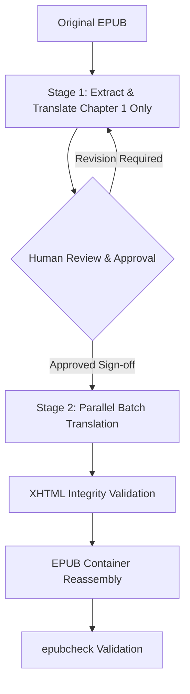

# EPUB Colloquial Cantonese Translation & Localization Guidebook

This document serves as a standard operating procedure (SOP) for systems engineers, localization architects, and agentic AI systems tasked with translating foreign-language EPUB books into natural, modern, and engaging spoken Cantonese (廣東話口語). 

It is designed to be harness-agnostic, providing highly optimized workflows, automation scripts, and precise linguistic guidelines that can be fed directly into any LLM-based agent (e.g., Antigravity, Windsurf, OpenCode) as system instructions.

---

## 1. Workflow & Token Optimization Strategy

To achieve human-grade colloquial flow while managing API token consumption efficiently, follow this strict two-phase localization lifecycle.



### Stage 1: Chapter 1 Translation & Approval (Human-in-the-Loop)
*   **Action:** The translation system must **ONLY** translate the first chapter (or a short initial benchmark section) first.
*   **Rationale:** Linguistic style (especially colloquial nuances like tone, particle usage, and name-blending) is highly subjective. Translating an entire book in a single pass without prior style alignment risks massive token waste if the output doesn't match the reader's expectation.
*   **Halt & Sign-off:** The agent must halt and request human review. Once the human provides explicit approval ("sign-off") on the tone and vocabulary of Chapter 1, this approved chapter serves as the **Golden Reference Style** for the rest of the book.

### Stage 2: Batch Translation
*   **Action:** Proceed with translating all remaining chapters, frontmatter, and backmatter, keeping the approved Chapter 1 as the system context reference.

### Sub-Agent Delegation Strategy (Cognitive Shielding & Context Isolation)
When utilizing multi-agent hierarchies to parallelize the translation of a large book, two major pitfalls are cognitive overload and main-agent context length exhaustion.
*   **Rule 1: Direct File Modification (No Content Funneling):** Sub-agents must **never** return translated chapters as text payloads back to the main agent for writing. Passing massive book contents through the main agent creates extreme context window pressure. Instead, sub-agents must read from and write to the target files directly on disk.
*   **Rule 2: Separation of Technical & Linguistic Concerns:** The main agent must shield sub-agents from global automation and structural packaging details. The main agent serves solely as a coordinator, managing the translation pipeline, invoking workers, and collecting progress feedback without processing the actual book content. If supported, the main agent should utilize a todo list and make the 1st pass and 2nd pass of every chapter an item of the list (instead of having an item like "translate every chapter" as a single task item which is difficult to track and retrace if there was an error). Multiple sub-agents can work on different chapters simultaneously, but one at a time. Do not ask the sub-agents to work on the multiple chapters at once.
*   **Execution Workflow:**
    1.  **Translation Phase (1st pass):** The main agent spawns a translator sub-agent. This sub-agent has already been supplied with the translation preferences in its system prompt. The main agent provides the path to the target XHTML file. The translator sub-agent directly reads, translates, and overwrites the target file on disk.
    2.  **Review Phase (2nd pass):** The main agent spawns a separate, independent reviewer sub-agent. This reviewer reads the modified file directly, performs objective evaluation, polishes the colloquial styling, fix typos, remove weird artifacts, and saves the finalized version directly to disk.
    3.  **Reporting:** Sub-agents report only high-level work summaries, completion status, and feedback to the main agent. Book contents do not enter the main agent's context. Upon the completion of each 1st and 2nd pass, the main agent should mark the corresponding todo list item complete ASAP so that it can track progress and avoid duplicate work.

---

## 2. Technical Pipeline & Automation Scripts

EPUB files are ZIP archives with extremely strict metadata and folder structures. The following automated pipeline guarantees that the book's structural integrity is maintained throughout the translation lifecycle.

### Step A: Safe Extraction (Unzip)
To extract the EPUB cleanly into a working directory without losing hidden files or metadata:

```bash
# Define paths
EPUB_PATH="original_book.epub"
EXTRACT_DIR="extracted"

# Unzip to target directory
unzip -q "$EPUB_PATH" -d "$EXTRACT_DIR"
```

### Step B: Spec-Compliant Rebuilding (Python ZIP Packer)
EPUB containers must adhere strictly to the **Open Container Format (OCF)** specifications. Specifically:
1. The first file in the ZIP archive must be named exactly `mimetype`.
2. The `mimetype` file must contain only the string `application/epub+zip` in ASCII, with no leading or trailing spaces, newlines, or extra headers.
3. The `mimetype` file must be written with **no compression** (`ZIP_STORED`).
4. All other files and directories must be added *after* the `mimetype` file and compressed using standard deflation (`ZIP_DEFLATED`).

Use the following robust Python script to repackage the EPUB:

```bash
# Run the repackaging script
python3 repack_epub.py <source_directory> <output_epub_name>
```

The script is located at `repack_epub.py` in the project root. It handles all OCF specification requirements automatically, including:
- Writing `mimetype` first with no compression (ZIP_STORED)
- Compressing all other files (ZIP_DEFLATED)
- Self-validation of the EPUB container structure

### Step C: Structural Validation (`epubcheck`)
Always validate the newly compiled EPUB using the industry-standard `epubcheck` CLI utility:

```bash
# Run epubcheck validation
epubcheck output_book.epub
```

#### Validation Success Criteria:
*   **The Zero-Regression Rule:** The newly generated EPUB must pass `epubcheck`.
*   **Inherited Legacy Errors vs. Blockers:** If the original source EPUB inherited minor, non-fatal errors (e.g., legacy CSS deprecations or missing external namespace declarations), these may be preserved. However, the translation process **must not introduce new blockers** (such as mismatched XML tags, unresolved file links, or broken character encodings).

---

## 3. Linguistic Style & Vocabulary Guide (The Core)

This section contains the core linguistic rules that transform formal texts into vivid, modern, and engaging spoken Cantonese (廣東話口語).

### A. Tone and Register Guidelines
*   **Authentic Oral Cadence:** The text must read as if a native speaker is narrating it live. Do not simply swap characters mechanically; restructure sentences to match Cantonese syntax and rhythm.
*   **Balanced Register:** Avoid stilted Standard Written Chinese (SWC / 書面語), but also avoid overly vulgar slang unless the context explicitly demands it (e.g., in character dialogue). Aim for a robust, highly readable, and engaging modern narrative voice.
*   **Foreign Word Blending (The Spoken Flow):** It is extremely natural in modern Cantonese speech to leave specialized terms, brand names, and proper nouns in English rather than translating them awkwardly. 

### B. Core Word Mapping Rules

| Written Particle (SWC) | Spoken Cantonese | Syntactic Context & Examples |
| :--- | :--- | :--- |
| **在** | **喺** / **喺度...緊** | **喺** (Locative): `喺沙灘度` (on the beach).<br>**喺度...緊** (Progressive): `佢喺度食緊嘢` (He is eating).<br>*Preserve in fixed idioms only (e.g. 所在, 迫在眉睫).* |
| **把** | **將** / *Restructure* | Avoid the formal disposal particle `把`. Use **將** (e.g., `將隻船推出去`) or restructure using serial verbs (e.g., `攞把刀嚟切肉` instead of `把刀拿去切肉`). *Note: Spoken `大把` (plenty of) is fully allowed.* |
| **了** | **咗** / **咗/晒/完/喇** | **咗** (Completed aspect): `去咗` (went).<br>**晒/完** (Finished): `食晒` (ate everything).<br>**喇** (Change of state): `落雪喇` (It's snowing now). |
| **是** | **係** | Replaced entirely in all copula contexts. |
| **那** | **嗰** / **嗰度** | Replaced in all demonstrative contexts: `嗰個人` (that person), `嗰陣時` (at that time). |
| **這** | **呢** / **呢度** | Replaced in all proximal contexts: `呢個` (this one), `呢度` (here). |
| **的** | **嘅** | Replaced in all possessive and modification contexts: `我嘅書` (my book), `好大嘅風` (strong wind). |
| **們** | **地** | Replaced in all plurals: `佢地` (they), `我地` (we), `各位隊員` (crew members). |
| **的確** | **真係** / **的確** | swap `的確` to `真係` in general speech, but `的確` can remain in formal narrative. |
| **它 / 牠 / 牠們** | **佢 / 佢地** | Swap all inanimate/animal third-person pronouns to **佢 / 佢地**. |

---

### C. Naming & Specialized Terminology Conventions
To keep the translation clean, dramatic, and readable, adhere to the **First-Mention Protocol**:

1.  **First Mention in a Chapter:** Format the term as `English Name (Cantonese Translation)` to establish clarity.
    *   *Example:* `Sir Ernest Shackleton (沙克爾頓爵士)`, `Endurance (堅毅號)`, `South Georgia Island (南喬治亞島)`.
2.  **Subsequent Mentions in Same Chapter:** Use the `English Name` (or standard abbreviation/surname) **directly** inside the Cantonese sentence, removing the Chinese translation.
    *   *Correct:* `Shackleton 隨即下令所有隊員登陸...`
    *   *Incorrect:* `Shackleton (沙克爾頓) 隨即下令...` (repetitive and clutters the reader's flow).

---

### D. Sentence-Level Translation Patterns (Side-by-Side)

Use these concrete sentence patterns as direct guidelines for structural refactoring.

#### 1. Locative and Motion (在 / 到了)
*   **Original English:** "When they finally arrived at the camp, they slept on the ice."
*   **Naive/SWC Translation:** 「當他們終於到了營地，他們在冰上睡覺。」
*   **Polished Spoken Cantonese:** 「當佢地終於去到營地嗰陣，就直接喺冰上面瞓覺。」

#### 2. disposal Constructions (把)
*   **Original English:** "Shackleton took the diary and threw it into the fire."
*   **Naive/SWC Translation:** 「沙克爾頓把日記拿起來扔進火裡。」
*   **Polished Spoken Cantonese:** 「Shackleton 攞起本日記，然後將佢扔入火堆度。」

#### 3. Passive and Adverse Situations (被)
*   **Original English:** "The three boats were continuously hammered by the giant waves."
*   **Naive/SWC Translation:** 「三艘小船被巨浪不斷地拍打。」
*   **Polished Spoken Cantonese:** 「三隻小船被巨浪係咁猛烈拍打。」 *(Or even more natural: 「巨浪係咁狂隊三隻小船。」)*

#### 4. Aspect and State Change (了 / 著)
*   **Original English:** "The temperature dropped rapidly, and the sea ice froze solid."
*   **Naive/SWC Translation:** 「氣溫急速下降了，海冰凍結實了。」
*   **Polished Spoken Cantonese:** 「氣溫急降，海冰結到實一實。」

#### 5. Progressive Actions (正在)
*   **Original English:** "Worsley was navigating in the storm, searching for the island."
*   **Naive/SWC Translation:** 「沃斯利正在暴風雨中航行，尋找著那個島嶼。」
*   **Polished Spoken Cantonese:** 「Worsley 喺暴風雨中一路航行，一路搵嗰個島。」

#### 6. Expressing Abundance (大把 vs. 把)
*   **Original English:** "Fortunately, they had plenty of seal meat to survive the winter."
*   **Naive/SWC Translation:** 「幸運的是，他們把海豹肉儲存了，有足夠的肉度過冬天。」
*   **Polished Spoken Cantonese:** 「但好彩，佢地手頭上仲有大把海豹肉，足夠頂過呢個冬天。」

#### 7. Direct/Indirect Quotes & Thought Registers
*   **Original English:** "Wild thought to himself, 'This is an impossibly difficult situation.'"
*   **Naive/SWC Translation:** 「維特心想：『這是一個極度困難的處境。』」
*   **Polished Spoken Cantonese:** 「Wild 心諗：『呢舖真係大鑊，衰到貼地。』」

---

## 4. Final Quality Checklist for Agents

Before delivering the translated chapter, verify the text against this automated pre-flight checklist:

- [ ] **Zero Forbidden SWC Particles:** No instances of `了`, `是`, `那`, `這`, `們`, or `的` as standalone grammatical particles in general narrative text (check frequency using python or grep). **Exception:** These characters are allowed when they appear as part of legitimate spoken Cantonese compound words (e.g., `了解`, `了結`, `明白`, `的士`, `的確` in formal narrative).
- [ ] **Locative Check:** Every locative `在` is swapped to `喺`. **Exception:** Preserve `在` in fixed idioms and compound words (e.g., `所在`, `迫在眉睫`, `在場`).
- [ ] **First-Mention Check:** Proper nouns follow the `English (Chinese)` format once, and only `English` thereafter in the same chapter.
- [ ] **Well-formed HTML/XML:** Every opening tag (`<span>`, `<i>`, `<small>`, `<p>`) has a perfectly matched closing tag. Ampersands are escaped as `&amp;`.
- [ ] **No truncated UTF-8 bytes:** UTF-8 character boundaries are intact (no splits caused by XML tags inserting into multi-byte strings).
